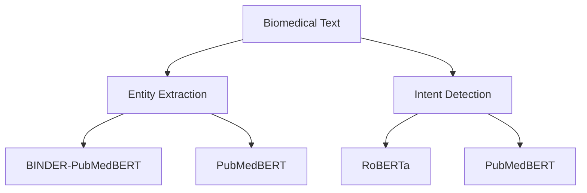

# Intent Detection and Entity Extraction from BioMedical Literature

This is the official repository of the paper **Intent Detection and Entity Extraction from BioMedical Literature**. 



## Model Demo

PubMedBERT fine-tuned on BC5CDR dataset [(Hugging Face Demo Link)](https://huggingface.co/psgrghvuo/pubmedbert_bc5cdr) and RoBERTa fine-tuned on translated KUAKE-QIC dataset [(Hugging Face Demo Link)](https://huggingface.co/psgrghvuo/roberta-base-qic) are shared for demo.


## Repository Organization

```bash
├── Chinese_ID_validation/
|    ├── CMID_validation.txt
|    ├── KUAKE-QIC_validation.txt
├── ID_datasets/
|    ├── test_mergedNER.csv
|    ├── train_mergedNER.csv
├── Joint_ID_NER_datasets/
|    ├── test_IHQID-1mg.csv
|    ├── train_IHQID-1mg.csv
|    ├── test_IHQID-WebMD.csv
|    ├── train_IHQID-WebMD.csv
├── model_cnn_lstm_ner/
|    ├── crf.py
|    ├── dataset.py
|    ├── main.py
|    ├── model.py
|    ├── train.py
|    ├── utils.py
├── model_handcrafted_features_ner/
|    ├── main.py
├── model_transformer_id/
|    ├── main.py
├── model_transformer_ner/
|    ├── main.py
├── NER_datasets/ 
|    ├── train_ncbi.txt
|    ├── test_ncbi.txt
|    ├── train_jnlpba.txt
|    ├── test_jnlpba.txt
|    ├── train_bc5cdr.txt
|    ├── test_bc5cdr.txt
|    ├── train_anatem.txt
|    ├── test_anatem.txt
|    ├── train_drugbank.txt
|    ├── test_drugbank.txt
|    ├── train_medline.txt
|    ├── test_medline.txt
├── run_id_experiments.sh
├── run_ner_experiments.sh
├── README.md
```

## Files Descriptions

1. **Chinese_ID_validation** - This folder contains the manual translation validation results for CMID and KUAKE-QIC datasets.
2. **ID_datasets** - This folder contains the train-test splits of mergedNER Intent Detection dataset.This dataset is made by merging train-test splits of Drug-Drug Interaction (DDI) dataset, NCBI Diease Dataset and JNLPBA Dataset.
2. **Joint_ID_NER_datasets** - This folder contains the train-test splits of IHQID-1mg and IHQID-WebMD datasets after preprocessing to BIO NER format. Please refer to [IHQID GitHub repository](https://github.com/indichealth/indic-health-demo) for further details.
4. **model_handcrafted_features** - This folder contains the code for running Logistic Regression and XGBosst models for NER.
5. **model_transformer_id** - This folder contains the code for running transformer models for Intent Detection.
6. **model_transformer_ner** - This folder contains the code for running transformer models for NER. Please refer to [BioBERT repository](https://github.com/dmis-lab/biobert-pytorch) for more details.
7. **NER_datasets** - This folder contains the train-test splits of the 5 biomedical NER datasets - Drug-Drug Interaction Dataset, JLPBA, BC5CDR, NCBI-Disease and, Anatomy Entity Mention Dataset. All the datasets converted to [CoNLL format](http://ufal.mff.cuni.cz/conll2009-st/task-description.html) and processed using processing steps used in [BioBERT repository](https://github.com/dmis-lab/biobert-pytorch). 
8. **run_id_experiments.sh** - Shell file for running Intent Detection experiments.
9. **run_ner_experiments.sh** - Shell file for running NER experiments.

## How to run the NER Experiments

- Preprocess the uploaded the dataset files to break the text examples considering the max token length. Change the "model" variable in run_experiments.sh and use the shell script to evaluate the model on all biomedical datasets:

    ``` 
    bash run_ner_experiments.sh
    ```
- Experiment outputs are written in the output directory.
- We use the open source implementation of [BINDER](https://github.com/microsoft/binder) for experiments with different encoder setups.

## How to run the Intent Detection (ID) Experiments

- Download the CMID/KUAKE-QIC datasets into ID_datasets directory or use the provided mergedNER dataset and run the shell script to evaluate the transformer models:

    ``` 
    bash run_id_experiments.sh
    ```
- Experiment outputs are written in the output directory.
- We use the train set of KUAKE-QIC dataset for training and dev set for testing. Train-test split for CMID was done by us. For mergedNER dataset we use the train and test splits of respective NER datasets. In mergedNER dataset, DDI (Drug Drug Interaction) dataset examples are used for drug intent, NCBI Diease dataset examples are used for disease intent and JNLPBA dataset examples were used for Genetics intent.
- Fasttext and TextCNN experiments were done with open source implmentations and as per the hyperparameters provided in the CMID paper.

## Joint Intent Detection and Entity Extraction

- We use the open source implementation of [JointBERT](https://github.com/monologg/JointBERT) for all the experiments. CoNLL BIO format converted IHQID (1mg and WebMD) datasets are also uploaded.

## Biomedical Search Query Trend on Google and Bing

- [Google Trends](https://trends.google.com/) was used for determing the increase in google search of 5 topics (Health, Medical Treatment, Medical diagnosis, Disease, Pharmaceutical drug) for the last decade. Figure 1(a) in the paper shows increase in number of searches on these topics over the years.

- Bing query log of 10th Jan of each year is used. 200 list type queries are randomly selected for each year and manually labeled as biomedical or non-biomedical. In Figure 1(b), we plot the percentage increase in percent of the biomedical queries each year.

## Intent Detection Translation validation

- Please refer to [CMID paper](https://bmcmedinformdecismak.biomedcentral.com/articles/10.1186/s12911-020-1122-3) and [CBLUE repository](https://github.com/CBLUEbenchmark/CBLUE) for original datasets in Chinese. Datasets are translated to english using Google Translate API. We take a random sample of 400 examplese from CMID and 400 random examples from Dev set of KUAKE-QIC dataset for manual validaiton by two Chinese experts. Apart from translation validation, we also provide correct manual translations in some cases. 
- More details on the process of translation validation are highlighted on [Chinese_ID_validation page](https://github.com/psgrghvuo/nlu-biomedical/tree/main/Chinese_ID_validation).
- We were not able to reproduce the performances reported in [CMID paper](https://bmcmedinformdecismak.biomedcentral.com/articles/10.1186/s12911-020-1122-3) on original Chinese version. The classification performance of models used by CMID authors (Fasttext, TextCNN, TextGCN) on English translations were worse than the results given by BERT and RoBERTa. We attach the email communication with the CMID authors below:


## References
* [Domain-Specific Language Model Pretraining for Biomedical Natural Language Processing](https://arxiv.org/pdf/2007.15779)
* [BioBERT: a pre-trained biomedical language representation model for biomedical text mining](http://doi.org/10.1093/bioinformatics/btz682)
* [Don't Stop Pretraining: Adapt Language Models to Domains and Tasks](https://arxiv.org/abs/2004.10964)
* https://github.com/jiesutd/NCRFpp
* https://github.com/melanietosik/maxent-ner-tagger
